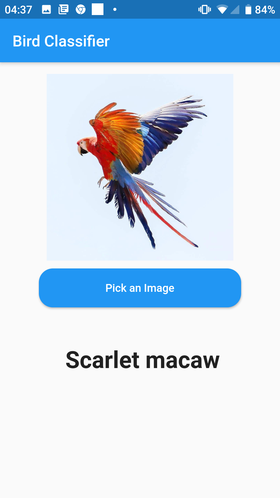
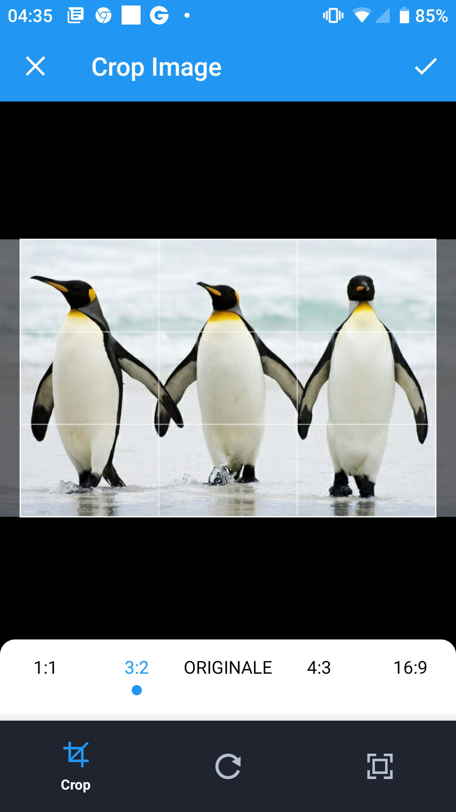

# Born Again Networks
This project is based on studies conducted by: Tommaso Furlanello, Zachary C. Lipton, Michael Tschannen, Laurent Itti, Anima Anandkumar in this paper: [Born Again Neural Networks
](https://arxiv.org/abs/1805.04770). The aim is to try to replicate the results using different datasets on the web. 
I also decided to test different models and, referring to the papers dealing with knowledge distillation (mentioned in BANN) I tested the results by varying the type of distillation (with logits and with temperature). The final step was to use one of the models produced to create an Android application with the Flutter framework.
### Main folder
The main folder contains a small library with files, which represent all the logic of the project:
  - **WideResNet** It's an implementation of the WideResidualNetwork from this paper [Wide Residual Networks](https://arxiv.org/abs/1605.07146), using Subclassing API 
  - **knowledge_distillation** It contains the distil_knowledge and ban method, the first one is used to distil knowledge from the teacher, the second one to train several generations of students starting from a master
  - **BANEnsemble** Just another implementation with Subclassing API in order to make easier the training of an Ensemble
  
#### Usage
##### WideResNet
It's a class and comes with some parameters, this is a standard usage example:
```
from WideResNet import WideResidualNetwork
model = WideResidualNetwork(n_classes=10, d=28, k=1, include_activation=True)
```
Maybe we need to use the model on a binary classification
```
from WideResNet import WideResidualNetwork
model = WideResidualNetwork(n_classes=2, d=28, k=1, include_activation=True, activation='sigmoid')
```

Working with knowledge distillation, we need to be able to remove the activation layer in many cases, so we can wrap it with a SequentialModel.
```
from WideResNet import WideResidualNetwork
tf.keras.models.Sequential([
     WideResidualNetwork(10, 16, 4, includeActivation=False),
     tf.keras.layers.Activation('softmax')]
)
```
##### knowledge_distillation
In this file there are the logic for knowledge distillation, let's see some usage examples, but before we need to take a look of an important parameter that both ban and distil_knowledge need in order to correctly operate: the the dictionary containing the values for training like the following one
```
fit_args = dict(
    epochs=100,
    validation_data=validation_generator,
    validation_steps=validation_generator.samples//BATCH_SIZE,
    steps_per_epoch=train_generator.samples//BATCH_SIZE,
    callbacks = callbacks
    )
```
And finally we can call the distil_knowledge method
```
history = distil_knowledge(teacher_model, student_model, train_generator, fit_args=fit_args)
```

ban takes essentially the same parameters as distil_knowledge, but in addition it requires the number of students, instead of the student it requires a function to build the student plus the parameters for the building.
The easier way to make the build_student function is throught a lambda expression like this:
```
build_student = lambda : tf.keras.models.Sequential([
                                            WideResidualNetwork(225, 28, 1, includeActivation=False),
                                            tf.keras.layers.Activation('softmax')
])
```

after understanding this let's see what the arguments for the compilation should look like:
```
compile_args = dict(
    optimizer='adam',
    loss='categorical_crossentropy',
    metrics=['accuracy']
)
```
And at the end we see an example of using the ban method with 3 students
```
histories, models = ban(teacher_model, 3, build_student, train_generator, fit_args, ground_truth_weight=1/N_CLASSES, compile_args=compile_args)
```
Remember that the first element of the pattern array returned by the method is always the teacher.
##### BANEnsemble
This is the easiest class to use in this directory, its constructor only requires an array of models that have compatible input_shape and output_shape, but let's see a complete example of build, compilation and evaluation
```
ban = BANEnsemble(students)
ban.compile(loss='categorical_crossentropy', optimizer='adam', metrics=['accuracy'])
ban.evaluate(test_generator)
```
If you want more detailed examples on the use of the methods, you can find them in the notebooks in the "notebooks" folder, the source contains several comments to clarify the use of the different parameters.

### Models folder
The models folder contains the models tested with bird classification, the others have been excluded for space reasons.To note that only the weights of the various models have been saved, so to load a specific model you will first have to build it and then load the weights.
Since these are WideResNet-28-2 models trained on 225 classes, we should do it this way:
```
loaded_model = tf.keras.models.Sequential(
    [
     WideResidualNetwork(225, 28, 2, includeActivation=False),
     tf.keras.layers.Activation('softmax')
    ]
)
loaded_model.build(input_shape=(None, 96, 96, 3))
loaded_model.compile(optimizer='adam', loss='categorical_crossentropy', metrics=['accuracy'])
loaded_model.load_weights('teacher.h5')
```
### Conclusion
The final product of all the work can be found in the "report" folder which contains an accurate description of the procedure used in pdf format. The various tests performed are all in the "notebooks" folder and finally in the android folder we have the project of the final application that makes use of the model produced in the tests. 






If someone wanted to test the application on their own without the build, I left the apk in the android folder. Have fun with it!

## Authors
 - **Federico Alfano**

## License
**GPLV3**
